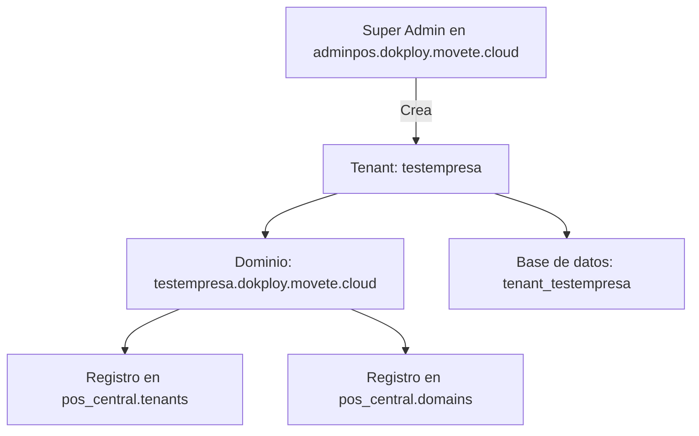
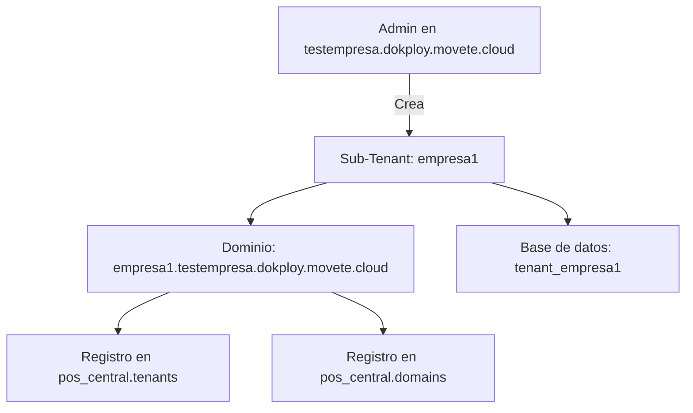

# 🏗️ Arquitectura Multi-Tenant - Guía Completa

## 📊 Estructura de Dominios

### ✅ Dominio Central (Super Admin)
**URL:** `adminpos.dokploy.movete.cloud`
- **Base de datos:** `pos_central`
- **Propósito:** Administración del sistema completo
- **Puede crear:** Tenants principales (empresas independientes)

### ✅ Tenant Principal (Empresas)
**Ejemplo:** `testempresa.dokploy.movete.cloud`
- **Base de datos:** `tenant_testempresa`
- **Propósito:** Operación de la empresa (ventas, productos, clientes, etc.)
- **Puede crear:** Sub-tenants (sucursales, franquicias)

### ✅ Sub-Tenant (Sucursales/Franquicias)
**Ejemplo:** `empresa1.testempresa.dokploy.movete.cloud`
- **Base de datos:** `tenant_empresa1`
- **Propósito:** Operación de la sucursal/franquicia
- **Puede crear:** Más sub-tenants si es necesario

---

## 🗄️ Bases de Datos

### Base de Datos Central: `pos_central`
**Contiene:**
- ✅ Tabla `tenants`: Registro de TODOS los tenants (principales y sub-tenants)
- ✅ Tabla `domains`: Dominios asignados a cada tenant
- ✅ Usuarios administradores del sistema central

**NO contiene:**
- ❌ Datos operacionales de las empresas (ventas, productos, etc.)

### Base de Datos de Tenant: `tenant_xxxxx`
**Contiene:**
- ✅ Usuarios de la empresa
- ✅ Productos, ventas, clientes, facturas
- ✅ Configuraciones específicas de la empresa
- ✅ Todos los datos operacionales

**NO contiene:**
- ❌ Información de otros tenants
- ❌ Registro de tenants/dominios (eso está en `pos_central`)

---

## 🔄 Flujo de Creación de Tenants

### Escenario 1: Super Admin crea una Empresa



**Datos guardados en `pos_central`:**
```sql
-- Tabla tenants
id: testempresa
name: testempresa
email: testempresa@gmail.com

-- Tabla domains
domain: testempresa.dokploy.movete.cloud
tenant_id: testempresa
```

---

### Escenario 2: Admin de Empresa crea una Sucursal



**Datos guardados en `pos_central`:**
```sql
-- Tabla tenants
id: empresa1
name: empresa1
email: empresa1@gmail.com

-- Tabla domains
domain: empresa1.testempresa.dokploy.movete.cloud
tenant_id: empresa1
```

> ⚠️ **IMPORTANTE:** Los tenants SIEMPRE se registran en `pos_central`, sin importar desde dónde se creen. Esto es CORRECTO y necesario para que el sistema de tenancy funcione.

---

## 🔧 Configuración del Archivo hosts

Para desarrollo local, necesitas agregar los dominios a tu archivo `hosts`:

**Windows:** `C:\Windows\System32\drivers\etc\hosts`

```text
# Dominio Central
127.0.0.1       adminpos.dokploy.movete.cloud
127.0.0.1       www.adminpos.dokploy.movete.cloud

# Tenants Principales
127.0.0.1       testempresa.dokploy.movete.cloud

# Sub-Tenants (Sucursales)
127.0.0.1       empresa1.testempresa.dokploy.movete.cloud
```

---

## 🎯 Redirecciones Después de Crear un Tenant

### ✅ Comportamiento Correcto (IMPLEMENTADO)

Cuando se crea un tenant, el usuario es redirigido al **login del NUEVO tenant recién creado**:

```php
// Ejemplo: Creaste empresa1 desde testempresa
// Redirige a: http://empresa1.testempresa.dokploy.movete.cloud/login
```

### ❌ Comportamiento Anterior (CORREGIDO)

Antes, siempre redirigía al dominio central, lo cual era incorrecto:

```php
// ❌ INCORRECTO: Redirigía a adminpos.dokploy.movete.cloud/login
```

---

## 🧪 Pruebas

### Prueba 1: Crear Empresa desde Dominio Central

1. Accede a: `http://adminpos.dokploy.movete.cloud/register-tenant`
2. Completa el formulario con los datos de la empresa
3. **Resultado esperado:**
   - Dominio creado: `nuevaempresa.dokploy.movete.cloud`
   - Redirección a: `http://nuevaempresa.dokploy.movete.cloud/login`
   - Base de datos creada: `tenant_nuevaempresa`
   - Registro en `pos_central.tenants` y `pos_central.domains`

### Prueba 2: Crear Sucursal desde un Tenant

1. Accede a: `http://testempresa.dokploy.movete.cloud/register-tenant`
2. Completa el formulario con los datos de la sucursal
3. **Resultado esperado:**
   - Dominio creado: `sucursal1.testempresa.dokploy.movete.cloud`
   - Redirección a: `http://sucursal1.testempresa.dokploy.movete.cloud/login`
   - Base de datos creada: `tenant_sucursal1`
   - Registro en `pos_central.tenants` y `pos_central.domains`

---

## 🐛 Solución de Problemas

### Problema: Error 404 al acceder al tenant

**Causa:** El dominio no está en el archivo `hosts` o está mal escrito.

**Solución:**
1. Abre `C:\Windows\System32\drivers\etc\hosts` como administrador
2. Agrega la línea: `127.0.0.1       [dominio-del-tenant]`
3. Guarda el archivo
4. Limpia caché de DNS: `ipconfig /flushdns` (en PowerShell)

### Problema: No redirige al login del nuevo tenant

**Causa:** Caché de rutas o configuración desactualizada.

**Solución:**
```bash
docker compose -f docker-compose.nginx.yml exec php php artisan route:clear
docker compose -f docker-compose.nginx.yml exec php php artisan cache:clear
docker compose -f docker-compose.nginx.yml restart php nginx
```

### Problema: El dominio se crea incorrectamente

**Causa:** El código antiguo no detectaba el contexto correctamente.

**Solución:** Ya está corregido en `TenantRegistrationController.php`. Si tienes tenants con dominios incorrectos, corrígelos manualmente:

```sql
UPDATE domains 
SET domain = '[dominio-correcto]' 
WHERE tenant_id = '[id-del-tenant]';
```

---

## 📝 Comandos Útiles

### Ver lista de tenants:
```bash
docker compose -f docker-compose.nginx.yml exec php php artisan tenants:list
```

### Ver tenants en la base de datos:
```bash
docker compose -f docker-compose.nginx.yml exec mysql mysql -uroot -proot_password pos_central -e "SELECT t.id, t.name, d.domain FROM tenants t LEFT JOIN domains d ON t.id = d.tenant_id;"
```

### Limpiar todas las cachés:
```bash
docker compose -f docker-compose.nginx.yml exec php php artisan route:clear
docker compose -f docker-compose.nginx.yml exec php php artisan config:clear
docker compose -f docker-compose.nginx.yml exec php php artisan cache:clear
docker compose -f docker-compose.nginx.yml exec php php artisan view:clear
```

### Reiniciar servicios:
```bash
docker compose -f docker-compose.nginx.yml restart php nginx
```

---

## ✅ Cambios Implementados

1. **TenantRegistrationController.php:**
   - ✅ Detecta automáticamente el contexto (central vs tenant)
   - ✅ Crea el dominio apropiado según el contexto
   - ✅ Redirige al login del nuevo tenant (no al central)

2. **routes/tenant.php:**
   - ✅ Agregadas rutas para crear sub-tenants desde tenants
   - ✅ Redirección automática a `/login` desde la raíz

3. **Dockerfile (PHP):**
   - ✅ Agregada extensión Redis para soporte de cache tagging

4. **docker-compose.nginx.yml:**
   - ✅ Cambio de driver de caché a Redis

---

## 🎓 Conceptos Clave

### ¿Por qué los tenants se guardan en `pos_central`?

Porque el sistema necesita saber:
1. **Qué dominios existen** (para enrutar correctamente)
2. **A qué base de datos conectarse** cuando llega una petición
3. **Estado del tenant** (activo, suspendido, etc.)

Es como un "directorio telefónico" que dice: "Si viene una petición de `testempresa.dokploy.movete.cloud`, conéctate a la base de datos `tenant_testempresa`".

### ¿Cuál es la diferencia entre Tenant y Sub-Tenant?

**Técnicamente:** Ninguna. Ambos son tenants con su propia base de datos.

**Lógicamente:**
- **Tenant:** Empresa independiente (`testempresa.dokploy.movete.cloud`)
- **Sub-Tenant:** Sucursal/franquicia de una empresa (`sucursal1.testempresa.dokploy.movete.cloud`)

El subdominio indica la jerarquía, pero funcionan igual.

---

## 📞 Soporte

Si encuentras algún problema, verifica:
1. ✅ Archivo `hosts` configurado correctamente
2. ✅ Servicios Docker corriendo (`docker compose ps`)
3. ✅ Logs de Laravel (`storage/logs/laravel.log`)
4. ✅ Logs de Nginx en contenedor

